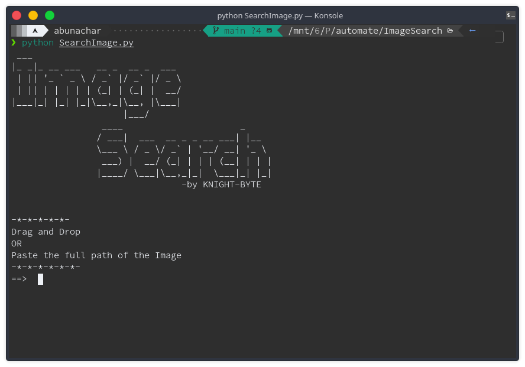
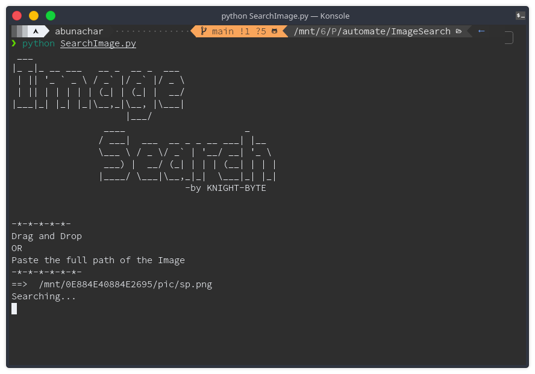

# Image Search

### This program is basically a google reverse image using command line i.e.

- Terminal in Linux or Max
- CMD(Command prompt) or PowerShell in Windows

### This program uses Selenium to perform the action in the browser

Installing the Selenium

```
pip install selenium
```

## To get started with this program

- Run the `SearchImage.py` int the terminal or CMD or powershell



- Then Drag and Drop the image or Paste the full Path of the image and hit enter



- After Loading up this image it will open up the result of the image in browser


## Note :

This Program is just for fun purpose and knowing how thing interact with each other.
I usually use google reverse image search to search image but takes up time opening google,selecting the image option and then uploading the image what you want to search.But with this program i have tone of my time by just pasting the link in terminal,everything else is done by the program,with this you can say I am a lazy person😄.
