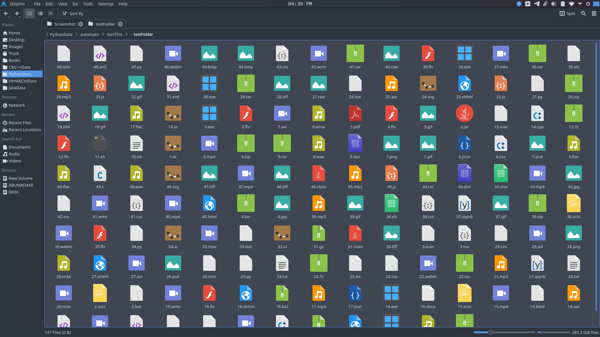
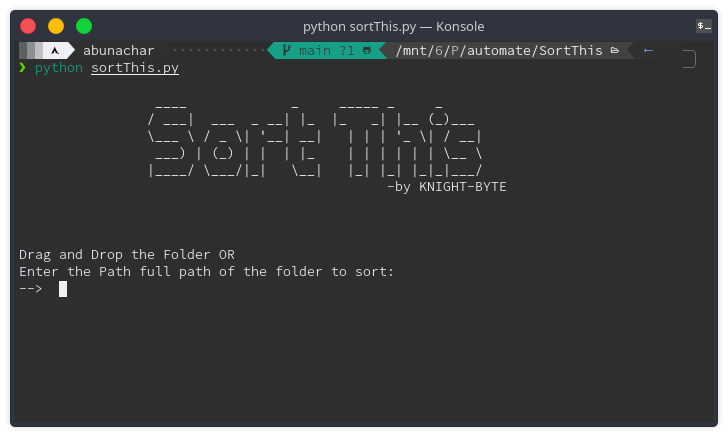
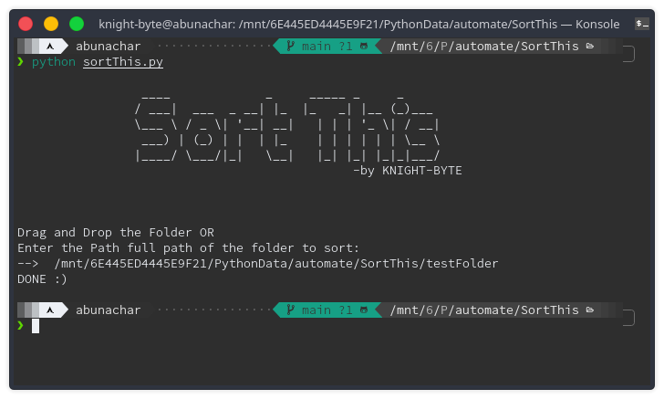
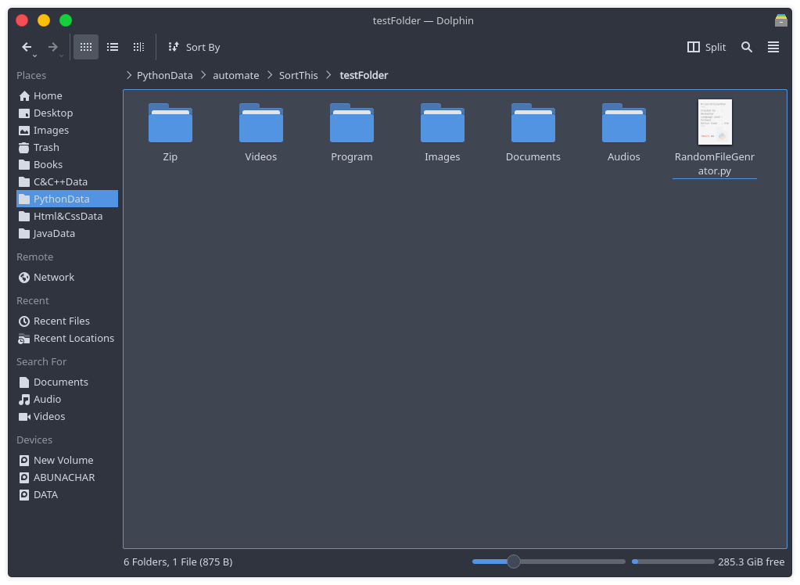
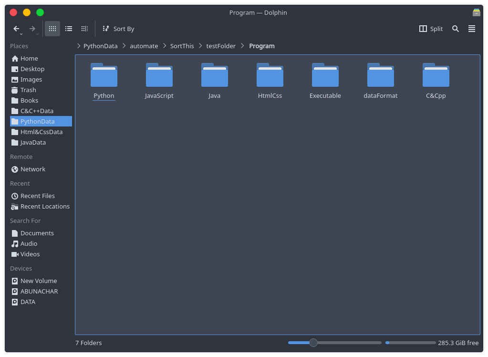

# Directory/Folder Sorter

### This program is basically a Directory Sorter using command line i.e.

- Terminal in Linux or Mac
- CMD(Command prompt) or PowerShell in Windows

## Test Folder Included:

### With the test folder You can test this Program How it actually works before implementing on your original Directory

- This testFolder include a `RandomFileGenerator.py ` which can generate random file with random extention.

- You can Enter the No of file you want to generate.
- After successfully creating random files Then you can Run the Program `sortThis.py`
- Then copy the Full path of the `TestFolder` and enter it into the Program Prompt or drag and drop it. Done thats all You have to do.

## ScreenShots of the Process:-

### Before sorting the Directory/Folder(Full of Random Files)

### Running the ` sortThis.py`

### Enter the Directory Path and hit enter

### After program Execution

### Few main Folder also contain sorted Sub Folder

-like Program folder contain different Language sorted Folder like this

# Note :

- This Program is only sort the files Not the Folder, it will keep it as it is.
- If the Program doesnt Recognize the file extention it will keep them in `Unknown ` Folder.
- You can add more extention in the Program to add your file to suitable Folder if not available
- This program is very Usefull for people like me who have all content in one folder or Students keep all their lecture Notes images ,pdfs,ppts.etc in one folder which will take up time to sort out all the stuff
- With this Just Pasting the Folder path or Dragging and Dropping the Folder in the terminal or CMS/powerline will do all that stuff for YOU

## Made with ❤ in India
