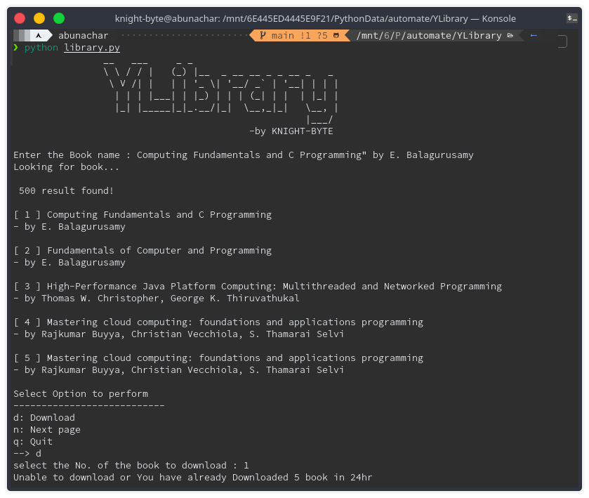

# Library Search

### This program is basically a Book downloader using command line i.e.

- Terminal in Linux or Mac
- CMD(Command prompt) or PowerShell in Windows

## To get started with this program

- Run the `libraryV2.py` int the terminal or CMD or powershell

- Enter the Name of the book You want to Download and hit enter

- It will load up the result and show the options you can perform

- select d to Download book ,n for next page, q for quit

- Then it will prompt user to select the book to Download (user can select the book by entering the number infront of the book)

### And it will automatically start downloading the book and will show the download progress bar and downloaded completed message at the bottom

## Note :

This Program is just for fun purpose and knowing how thing interact with each other.

- You can only Download 5 Books in one day.
  Once you have reached your daily limit and try to download another book it will prompt a message
  

- After download is completed it will be downloaded in Default download loction ,in case you dont find that book in the Download location it will be in the folder where this program is running.

## Made with ❤ in India
